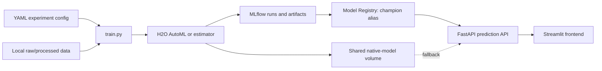
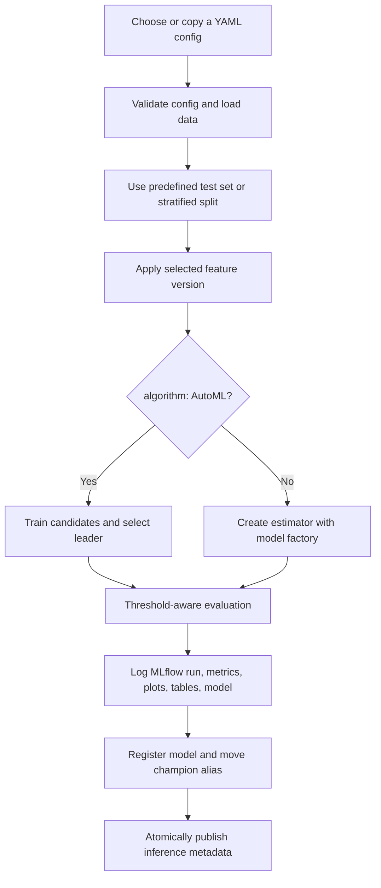

# Credit Card Fraud Detection MLOps

An end-to-end fraud detection application using H2O AutoML and explicit H2O
estimators, MLflow experiment tracking and model registry, FastAPI inference,
Streamlit, and Docker Compose. Every experiment is launched through the single
`backend/train.py` entry point with a YAML configuration.

## Architecture



- `backend/train.py` — the only training entry point
- `backend/experiment_utils.py` — config, data split, metrics, and artifacts
- `backend/model_factory.py` — AutoML and explicit-estimator construction
- `backend/configs/` — experiment definitions
- `backend/main.py` — registry-first FastAPI model serving
- `frontend/app.py` — Streamlit upload, prediction, and evaluation interface

## Dataset

The full [Kaggle Credit Card Fraud Detection](https://www.kaggle.com/datasets/mlg-ulb/creditcardfraud)
dataset is not included because it exceeds GitHub's practical file-size limits.
Download `creditcard.csv` separately and place it at:

```text
backend/data/raw/creditcard.csv
```

Generate the processed data from `backend`:

```powershell
cd backend
python preprocess_creditcard.py
```

The preprocessing pipeline removes `Time`, fits `StandardScaler` using only the
training split's `Amount` values, transforms the train and test splits, and
creates the lightweight sample files used for API and Streamlit demonstrations.

Raw and processed data stay local. Git includes only `backend/data/sample_test.csv`
and `backend/data/sample_test_labeled.csv` for lightweight demonstrations.
Use `sample_test.csv` for prediction-only uploads and
`sample_test_labeled.csv` for predictions with evaluation metrics and a
confusion matrix.

## Experiment workflow



From `backend`, launch any experiment without editing Python:

```powershell
python train.py --config configs/baseline.yaml
python train.py --config configs/gbm_tuned.yaml
python train.py --config configs/random_forest.yaml
python train.py --config configs/feature_engineering.yaml
python train.py --config configs/threshold.yaml
```

For a quick pipeline check using only the versioned sample data:

```powershell
python train.py --config configs/smoke_test.yaml
```

To add an experiment, copy one YAML file, choose a unique `experiment_name`,
change the desired values, and run the same command with the new path. Run names
default to `<experiment>-<algorithm>-<UTC timestamp>` for clear comparison;
set `run_name` explicitly when a semantic label is preferable.

## Configuration reference

| Parameter | Meaning |
|---|---|
| `experiment_name` | MLflow experiment used to group related runs. |
| `run_name` | Optional MLflow display name; generated with a UTC timestamp when omitted. |
| `algorithm` | `AutoML`, `GBM`, `RandomForest`/`DRF`, or `XGBoost`. |
| `target` | Binary target column, normally `Class`. |
| `feature_version` | `baseline` or the inference-safe `engineered_v1`. |
| `threshold` | Positive-class probability cutoff used for metrics and serving. |
| `train_path`, `test_path` | Paths resolved from the current working directory. |
| `use_pre_split_test` | Use `test_path` when true; create a stratified split when false. |
| `test_size` | Fraction held out when `use_pre_split_test` is false. |
| `sample_frac` | Reproducible stratified fraction of training rows to use. |
| `max_runtime_secs` | AutoML/estimator runtime limit; `0` means no explicit limit. |
| `max_models` | Maximum AutoML candidate count; informational for explicit estimators. |
| `seed` | Random seed for splitting, sampling, CV, and model training. |
| `stopping_metric` | H2O early-stopping metric, such as `AUC` or `logloss`. |
| `stopping_rounds` | Consecutive non-improving scoring rounds before early stopping; `0` disables it. |
| `sort_metric` | Metric used to order the AutoML leaderboard. |
| `balance_classes` | Enables or disables H2O class balancing. |
| `nfolds` | Cross-validation folds; `0` disables cross-validation. |
| `include_algos` | AutoML allow-list. Cannot be combined with `exclude_algos`. |
| `exclude_algos` | AutoML deny-list. Cannot be combined with `include_algos`. |
| `parameters` | Algorithm-specific estimator options such as `ntrees`. |

## MLflow workflow

Each run logs the full resolved configuration (including defaults), experiment and
run names, UTC timestamps, tags, leaderboard, accuracy, precision, recall, F1,
ROC-AUC, confusion matrix, ROC curve, Precision-Recall curve, feature importance
when supported, prediction sample, model metadata, exact YAML, and MLflow H2O
model. After successful model registration, the configured registry alias is
moved to the new version and deployment files are atomically updated.

Open http://localhost:5000, select an experiment, select multiple runs, and use
MLflow's comparison view to compare parameters and metrics.

## Docker workflow

From the project root:

```powershell
.\start.ps1 -Rebuild
```

Alternatively:

```powershell
docker compose up --build
```

Compose starts MLflow, runs `configs/baseline.yaml`, starts FastAPI after training
completes, and starts Streamlit after the API health check passes.
The trainer receives `backend/data` as a read-only bind mount; datasets are not
copied into the backend image.

- Streamlit: http://localhost:8501
- MLflow: http://localhost:5000
- FastAPI docs: http://localhost:8000/docs

To deploy a different experiment through Compose, change only the trainer's
`--config` path in `docker-compose.yml` and rebuild.

## Local execution workflow

Install the backend dependencies and start MLflow:

```powershell
cd backend
python -m venv .venv
.\.venv\Scripts\Activate.ps1
pip install -r requirements-backend.txt
mlflow server --host 127.0.0.1 --port 5000
```

In another terminal, set the tracking URI, train, then start FastAPI:

```powershell
cd backend
$env:MLFLOW_TRACKING_URI = "http://127.0.0.1:5000"
python train.py --config configs/baseline.yaml
uvicorn main:app --host 0.0.0.0 --port 8000
```

Start Streamlit in a third terminal:

```powershell
cd frontend
pip install -r requirements-frontend.txt
$env:BACKEND_URL = "http://127.0.0.1:8000/predict"
streamlit run app.py
```

## Repository safety

The `.gitignore` excludes raw/processed data, MLflow stores, generated models,
virtual environments, caches, secrets, keys, IDE state, and temporary files.
Never force-add those files or commit credentials. Source code, configs, notebooks,
Docker definitions, requirements, documentation, and sample CSVs remain versioned.

## AWS EC2 production deployment

Production uses the local Compose definition plus `docker-compose.prod.yml`. The
base file retains local loopback access, while the production overlay adds an
Nginx HTTPS reverse proxy and environment-rendered landing page. MLflow, FastAPI,
Streamlit, and H2O remain on the private Docker network; only Nginx publishes
ports 80 and 443 publicly.

### Production URLs

| Service | URL |
|---|---|
| Landing page | https://fraud.barbaraplascencia.com |
| Streamlit | https://app.barbaraplascencia.com |
| FastAPI | https://api.barbaraplascencia.com |
| Swagger | https://api.barbaraplascencia.com/docs |
| Health | https://api.barbaraplascencia.com/health |
| MLflow | https://mlflow.barbaraplascencia.com |
| H2O Flow | https://h2o.barbaraplascencia.com |
| GitHub | https://github.com/AIQwerty-practice/AIDev_CC_Fraud_MLOPS |

### EC2 prerequisites

Use a current Ubuntu LTS EC2 instance with enough memory for H2O training (8 GB
minimum is a practical starting point), attach an Elastic IP, and install Docker:

```bash
sudo apt-get update
sudo apt-get install -y ca-certificates curl git
curl -fsSL https://get.docker.com | sudo sh
sudo usermod -aG docker "$USER"
newgrp docker
git clone https://github.com/AIQwerty-practice/AIDev_CC_Fraud_MLOPS.git
cd AIDev_CC_Fraud_MLOPS
cp .env.example .env
```

Edit `.env`, especially `CERTBOT_EMAIL`. Do not commit `.env`. Place the Kaggle
dataset at `backend/data/raw/creditcard.csv`, then preprocess it as documented in
the Dataset section. The trainer mounts `backend/data` read-only.

### DNS records

Create these records after assigning the EC2 Elastic IP:

| Type | Host | Value |
|---|---|---|
| A | `fraud` | EC2 Elastic IP |
| A | `app` | EC2 Elastic IP |
| A | `api` | EC2 Elastic IP |
| A | `mlflow` | EC2 Elastic IP |
| A | `h2o` | EC2 Elastic IP |

Wait for all names to resolve to the Elastic IP before requesting certificates.

### EC2 security group

Allow inbound traffic only as follows:

| Port | Source | Purpose |
|---|---|---|
| 22/TCP | Your administrator IP/CIDR | SSH |
| 80/TCP | `0.0.0.0/0`, `::/0` | HTTP redirect and certificate validation |
| 443/TCP | `0.0.0.0/0`, `::/0` | HTTPS applications |

Do not open 5000, 8000, 8501, or 54321. Those ports bind to EC2 loopback and
are reached by Nginx through Docker service names.

### HTTPS certificates

After DNS propagation, make the scripts executable and request one certificate
covering all subdomains:

```bash
chmod +x deploy/aws/*.sh
./deploy/aws/bootstrap-certificates.sh
```

Equivalent Certbot domains are:

```bash
sudo certbot certonly --standalone \
  -d fraud.barbaraplascencia.com \
  -d app.barbaraplascencia.com \
  -d api.barbaraplascencia.com \
  -d mlflow.barbaraplascencia.com \
  -d h2o.barbaraplascencia.com
```

Certificates and private keys stay under `/etc/letsencrypt` and must never be
committed. Nginx redirects HTTP to HTTPS. Schedule renewal with root's crontab:

```cron
15 3 * * * /absolute/path/AIDev_CC_Fraud_MLOPS/deploy/aws/renew-certificates.sh >> /var/log/fraud-certbot.log 2>&1
```

### Deploy and restart

Initial deployment:

```bash
./deploy/aws/deploy.sh
```

Routine update and restart:

```bash
git pull --ff-only
docker compose --env-file .env -f docker-compose.yml -f docker-compose.prod.yml up -d --build
docker compose --env-file .env -f docker-compose.yml -f docker-compose.prod.yml ps
```

View logs and restart individual services:

```bash
docker compose --env-file .env -f docker-compose.yml -f docker-compose.prod.yml logs -f
docker compose --env-file .env -f docker-compose.yml -f docker-compose.prod.yml restart proxy backend frontend
```

Stop production without deleting persistent MLflow/model volumes:

```bash
docker compose --env-file .env -f docker-compose.yml -f docker-compose.prod.yml down
```

Do not use `down -v` in production unless persistent experiment and model state is
intentionally being destroyed.

### Reverse proxy behavior

Nginx routes the five production hostnames to `landing`, `frontend`, `backend`,
`mlflow`, and `h2o`. It forwards the original host, client address, and HTTPS
scheme. Streamlit receives WebSocket upgrade headers and disabled proxy buffering.
FastAPI trusts forwarded headers only inside the production Docker network and
CORS allows only the configured landing and Streamlit origins.

### Production hardening recommendations

- Put authentication in front of MLflow and H2O Flow before allowing general internet access.
- Back up the `mlflow_data` and `model_artifacts` volumes regularly.
- Use AWS Systems Manager Session Manager instead of public SSH where possible.
- Store operational secrets in AWS Systems Manager Parameter Store or Secrets Manager.
- Add CloudWatch log shipping, uptime alerts, and disk/memory monitoring.
- Pin container image and Python dependency versions after validation.
